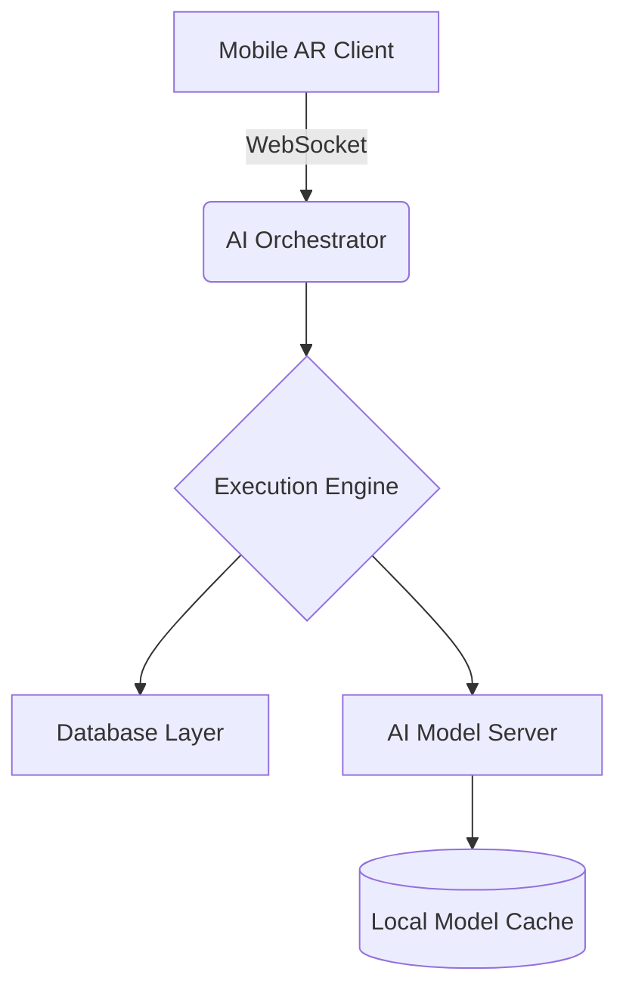

# System Architecture

## Core Components

### 1. AI Orchestration Layer
- **FastAPI Server**: Handles API requests and WebSocket connections
- **Task Queue**: Redis-backed queue for parallel AI processing
- **Agent Manager**: Allocates tasks to AI workers

### 2. Mobile Platform
- **AR Renderer**: Unity-based 3D visualization
- **Offline Sync**: Local SQLite database with conflict resolution
- **Secure Channel**: E2EE communication tunnel

### 3. Deployment Infrastructure
- **Docker Swarm**: Container orchestration
- **Monitoring Stack**: Prometheus + Grafana metrics
- **Auto-scaling**: Kubernetes HPA rules